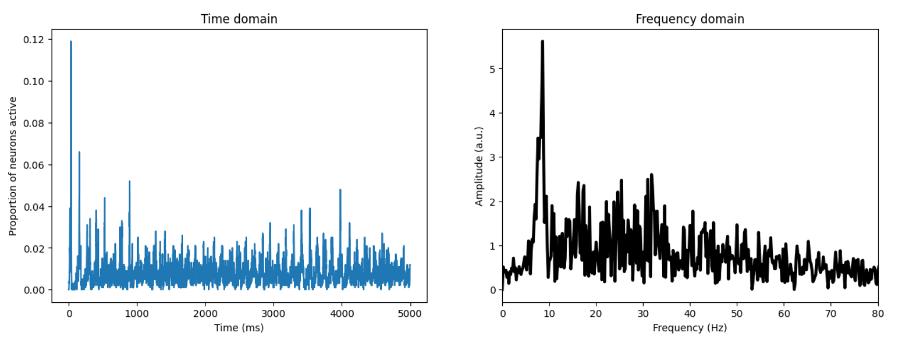
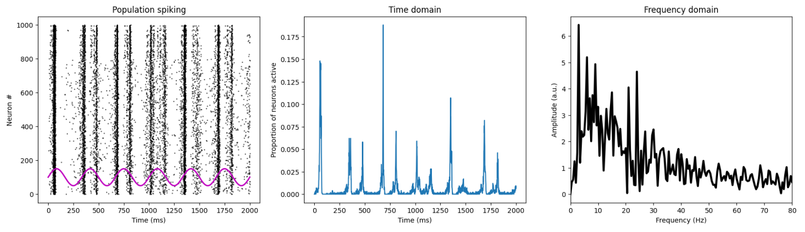

<!-- ABOUT THE PROJECT -->
## 1. Introduction

### 1.1 Overview

This project focuses on the development and analysis of a simplified neural
model that captures the core features of brain dynamics. Utilizing mathematical
equations and computational simulations, the model provides insights into the
fundamental aspects of neural activity and behavior.

### 1.2 Goal

Utilize mathematical and computational modeling to decipher fundamental aspects
of neural dynamics within the brain.

### 1.3 Model

A collection of interconnected equations that dictate a streamlined depiction of
the brain's structure and function.

### 1.4 Background

Science and inspiration by - [E.M.
Izhikevich](https://www.izhikevich.org/publications/spikes.htm)

(<a href="#top">back to top</a>)

## 2 Simulations

## 2.1 Simulating One Brain Cell

1. Import libraries:

- numpy is imported as np for numerical operations.
- matplotlib.pyplot is imported as plt for plotting the results.

2. Define the parameters:

- a, b, c, and d are parameters for the neuron model.
- v represents the initial membrane potential.
- u is initialized as the product of b and v.

3. Initialize variables for the simulation:

- simulation_time is set to 1000, representing the total time for the simulation.
- memvolt and Iall are NumPy arrays initialized with zeros, which will store the
membrane voltage and stimulation values, respectively, for each time step.

4. Run the simulation:

- A loop iterates through the simulation_time.
- The variable I represents the external input to the neuron, which is set to -2
between time steps 200 and 400 and 7 otherwise.
- If the membrane potential v reaches or exceeds 30 mV, an action potential
occurs, causing v to reset to the value of c, and u is updated by adding d.
- The membrane voltage v and variable u are updated using the given equations.
- The updated membrane voltage v and input I are stored in their respective arrays
at the current time step.

5. Plot the results:

- A figure and axes are created using plt.subplots().
- The membrane potential (memvolt) and stimulation (Iall) are plotted against time.
- The x-axis is labeled 'Time (ms)', and the y-axis is labeled 'Membrane voltage (mV)'.
- The plot is displayed using plt.show().

The result is a visual representation of the neuron model's membrane potential
over time, allowing you to observe how the neuron responds to the input
stimulation.

  

(<a href="#top">back to top</a>)

## 2.2 Simulating 1000 Neurons

This section represents the implementation of a neural circuit consisting of
1000 neurons, including both excitatory and inhibitory neurons. The code sets up
the parameters and initial conditions for the neural circuit and defines the
synaptic weights matrix.

1. Define the number of neurons:

- Ne represents the number of excitatory neurons (800).
- Ni represents the number of inhibitory neurons (200).

2. Generate random values for re and ri:

- re is an array of random values of size Ne (800) for excitatory neurons.
- ri is an array of random values of size Ni (200) for inhibitory neurons.

3. Set up parameters for the neurons:

- a, b, c, and d are arrays representing the parameters for each neuron in the
circuit. The np.hstack() function is used to concatenate the values for
excitatory and inhibitory neurons.

The parameters for excitatory neurons are based on the random values in re,
while those for inhibitory neurons are based on the random values in ri.

4. Initialize membrane potential v and variable u:

-v is initialized as an array of -65 mV for all neurons, both excitatory and
inhibitory.
- u is computed as the product of the b parameter and v.

5. Define the synaptic weights matrix S:

- S is a matrix of size (Ne+Ni, Ne+Ni) representing the all-to-all synaptic
weights between neurons in the circuit.
- The first part (.5*np.random.rand(Ne+Ni, Ne)) represents the synaptic weights
between excitatory neurons and all neurons in the circuit. The values are
randomly generated and scaled by 0.5.
- The second part (-np.random.rand(Ne+Ni, Ni)) represents the synaptic weights
between inhibitory neurons and all neurons in the circuit. The values are
randomly generated and negated to indicate inhibitory connections.

In summary, this code sets up a neural circuit of 1000 neurons with distinct
excitatory and inhibitory properties, initializes the membrane potential and
variable u, and defines the synaptic weights matrix for all-to-all connections.

(<a href="#top">back to top</a>)

## 2.3 Visualize

This code snippet is responsible for visualizing the firing activity of the
neurons in the circuit using a raster plot. It displays a plot where the x-axis
represents time (in milliseconds), and the y-axis represents the neuron number
(1 to 1000). Each dot in the plot corresponds to a firing event, with the neuron
number on the y-axis and the time of firing on the x-axis.

1. Create a figure and axes:
   - fig, ax = plt.subplots(1, figsize=(10, 7)): This line creates a new figure with one subplot (axes) and sets the figure size to 10 inches wide and 7 inches tall. 
   
2. Plot the firing events:
   - plt.plot(firings[0, :], firings[1, :], 'k.', markersize=1): This line plots the firing events as black dots (indicated by 'k.') with a marker size of 1. The time of firing is retrieved from the first row of the firings array (firings[0, :]), while the neuron number is retrieved from the second row (firings[1, :]).

3. Set the axis labels:
   - plt.xlabel('Time (ms)'): This line sets the x-axis label to "Time (ms)".
   - plt.ylabel('Neuron #'): This line sets the y-axis label to "Neuron #".

4. Display the plot:
   - plt.show(): This line displays the generated raster plot.

The resulting raster plot provides a visual representation of the firing activity of each neuron in the circuit over time, allowing for the observation of patterns and dynamics within the neural circuit.

  

(<a href="#top">back to top</a>)

## 2.4 Visualize the Population Spiking Activity

This section is responsible for visualizing the population spiking activity
of the neurons in the circuit over time, both in the time domain and the
frequency domain.

1. Initialize population spiking activity array `popact`:
   - popact = np.zeros(simulation_time): Create an array of zeros with the same size as `simulation_time`.

2. Loop over time and find the units that spiked at that time:
   - for ti in range(simulation_time):
     - popact[ti] = np.sum(firings[0,:]==ti) / (Ne+Ni): For each time step `ti`, calculate the proportion of neurons that fired at that time by dividing the number of firing neurons by the total number of neurons (Ne+Ni).

3. Create a figure with two subplots:
   - fig, ax = plt.subplots(1, 2, figsize=(15, 5)): Create a new figure with two subplots (axes) arranged horizontally, and set the figure size to 15 inches wide and 5 inches tall.

4. Time-domain plot:
   - ax[0].plot(popact): Plot the population spiking activity over time.
   - ax[0].set_xlabel('Time (ms)'): Set the x-axis label to "Time (ms)".
   - ax[0].set_ylabel('Proportion of neurons active'): Set the y-axis label to "Proportion of neurons active".
   - ax[0].set_title('Time domain'): Set the title of the subplot

  

(<a href="#top">back to top</a>)

## 2.5 Running Function

This code snippet defines a function `simCircuit(I)` to run the neural network
simulation with a given input stimulus `I`.

1. Define the function `simCircuit(I)`:
   - def simCircuit(I):

2. Initialize `firings` array:
   - firings = np.array([[], []]): Create an empty 2D array to store the firing times and neuron indices.

3. Set initial values of `v` and `u`:
   - v = -65 * np.ones(Ne + Ni): Initialize membrane potentials `v` for all neurons to -65.
   - u = b * v: Initialize the recovery variable `u` by multiplying `b` with `v`.

4. Loop through the simulation time:
   - for t in range(len(I)):

5. Define the stimulation for each neuron:
   - stim = np.hstack((4 * np.random.randn(Ne), 1 * np.random.randn(Ni))) + I[t]: Create a random stimulation for excitatory and inhibitory neurons, and add the input stimulus `I[t]`.

6. Check if an action potential occurred and update `firings`:
   - fired = np.where(v >= 30)[0]: Find the indices of neurons that fired (membrane potential >= 30).
   - tmp = np.stack((np.tile(t, len(fired)), fired)): Create a temporary array with firing times and neuron indices.
   - firings = np.concatenate((firings, tmp), axis=1): Concatenate the temporary array with the `firings` array.

7. Update membrane variables for cells that fired:
   - v[fired] = c[fired]: Reset membrane potentials `v` of fired neurons to their respective `c` values.
   - u[fired] = u[fired] + d[fired]: Update the recovery variable `u` of fired neurons by adding their respective `d` values.

8. Update membrane variables for down-stream cells:
   - stim += np.sum(S[:, fired], axis=1): Add the sum of synaptic weights `S` from fired neurons to the stimulation.

9. Update membrane voltage and recovery variable:
   - v += .04 * v**2 + 5 * v + 140 - u + stim: Update membrane potentials `v` using the Izhikevich model equation.
   - u += a * (b * v - u): Update the recovery variable `u` using the Izhikevich model equation.

10. Return `firings` array:
   - return firings: The function returns the `firings` array containing the firing times and neuron indices.

(<a href="#top">back to top</a>)

## 2.6 Visualizing Function

This code snippet defines a function `plotPopActivity(firings)` to visualize the
results of the neural network simulation, including the population spiking
activity, time-domain plot, and frequency-domain plot.

1. Define the function `plotPopActivity(firings)`:
   - def plotPopActivity(firings):

2. Calculate the maximum number of time points:
   - npnts = int(np.max(firings[0, :]) + 1): Find the maximum firing time and add 1, since it starts at 0.

3. Initialize population spiking activity array `popact`:
   - popact = np.zeros(npnts): Create an array of zeros with the same size as `npnts`.

4. Loop over time and find the units that spiked at that time:
   - for ti in range(npnts):
     - popact[ti] = np.sum(firings[0, :] == ti) / (Ne + Ni): For each time step `ti`, calculate the proportion of neurons that fired at that time by dividing the number of firing neurons by the total number of neurons (Ne + Ni).

5. Calculate amplitude spectrum `popactX`:
   - popactX = np.abs(np.fft.fft(popact - np.mean(popact))): Compute the amplitude spectrum by applying the Fast Fourier Transform (FFT) to the detrended population activity.
   - hz = np.linspace(0, 500, int(npnts / 2 + 1)): Create a frequency axis from 0 to 500 Hz with a length equal to half of the time points plus 1.

6. Create a figure with three subplots:
   - fig, ax = plt.subplots(1, 3, figsize=(20, 5)): Create a new figure with three subplots (axes) arranged horizontally, and set the figure size to 20 inches wide and 5 inches tall.

7. Population spiking plot:
   - ax[0].plot(firings[0, :], firings[1, :], 'k.', markersize=1): Plot the firing events as black dots (indicated by 'k.') with a marker size of 1.
   - ax[0].set_xlabel('Time (ms)'): Set the x-axis label to "Time (ms)".
   - ax[0].set_ylabel('Neuron #'): Set the y-axis label to "Neuron #".
   - ax[0].set_title('Population spiking'): Set the title of the subplot.

8. Time-domain plot:
   - ax[1].plot(popact): Plot the population spiking activity over time.
   - ax[1].set_xlabel('Time (ms)'): Set the x-axis label to "Time (ms)".
   - ax[1].set_ylabel('Proportion of neurons active'): Set the y-axis label to "Proportion of neurons active".
   - ax[1].set_title('Time domain'): Set the title of the subplot.

9. Frequency-domain plot:
   - ax[2].plot(hz, popactX[:len(hz)], 'k', linewidth=3): Plot the amplitude spectrum as a black line (indicated by 'k') with a linewidth of 3.
   - ax[2].set_xlim([0, 80]): Set the x-axis limits to 0-80 Hz.
   - ax[2].set_xlabel('Frequency (Hz)'): Set the x-axis label to "Frequency (Hz)".
   - ax[2].set_ylabel('Amplitude (a.u.)'): Set the y-axis label to "Amplitude (a.u.)".
   - ax[2].set_title('Frequency domain

(<a href="#top">back to top</a>)

## 2.7 Visualizing Function

This code snippet presents experiments with different input patterns to the
neural network simulation and visualizes the results using the `simCircuit()`
and `plotPopActivity()` functions defined earlier.

1. Create input patterns for the experiments:

   - Option 1: A constant input of 1, with a negative input of -2 from time step 400 to 600.
     - I = np.ones(1234)
     - I[400:601] = -2

   - Option 2: A quadratic input pattern ranging from -2 to 2.
     - I = (np.linspace(-2, 2, 3001))**2

   - Option 3: A sinusoidal input pattern with a frequency of 6 * pi.
     - I = np.sin(np.linspace(0, 6 * np.pi, 2000) * 2)

2. Run the simulation and plot the results:

   - networkspikes = simCircuit(I): Run the neural network simulation with the chosen input pattern `I` and store the resulting firing activity in the `networkspikes` variable.
   - plotPopActivity(networkspikes): Visualize the results of the neural network simulation using the `plotPopActivity()` function, which displays the population spiking activity, time-domain plot, and frequency-domain plot.

  

(<a href="#top">back to top</a>)

<!-- CONTACT -->
## 3. Contact

Erol Gelbul - [Website](http://www.erolgelbul.com)

Project Link: [The Brain](https://github.com/ErolGelbul/the_brain)

(<a href="#top">back to top</a>)

